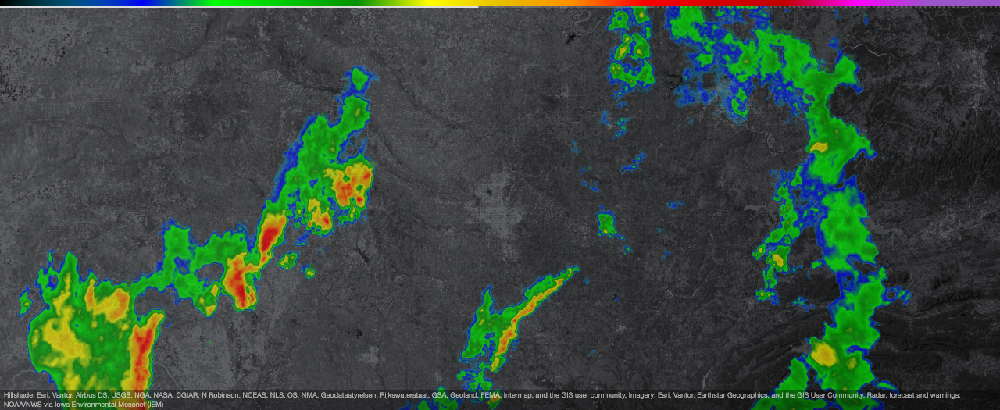
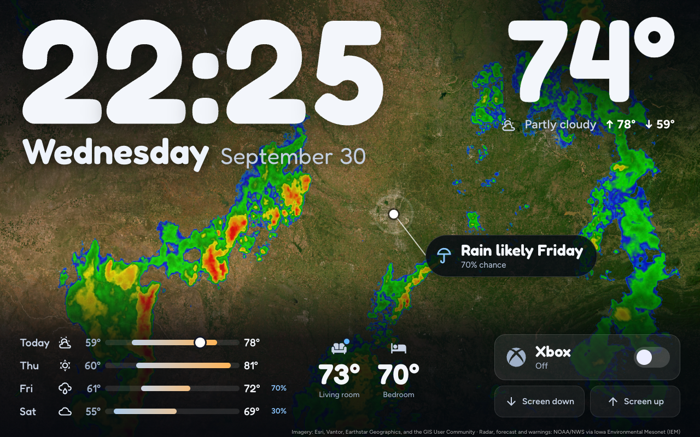
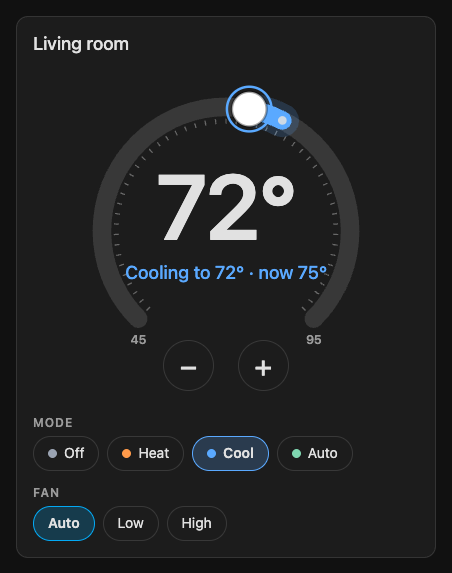

# radar-dash

A weather-radar wall display for Home Assistant: three Lovelace custom cards, plain JavaScript, no build step,
no API keys.

- **`wall-radar-card`** loops live NEXRAD radar over a dark or satellite basemap, with a short-range forecast and
  NWS warning outlines. This is the supported part. One line of YAML is enough to run it.
- **`wall-horizon-card`** is the full-screen wall layout built around it: clock, date, outside temperature, forecast,
  room thermostats and a few household controls. It ships **as-is, adapt it**: it was drawn for one 1280 x 800
  tablet, and every household feature is optional.
- **`wall-thermostat-card`** is a thermostat dial for one `climate` entity, for any dashboard. It is the Horizon
  layout's thermostat, as a card of its own. It does not need the radar.

**The radar and Horizon cards are United States only.** Their radar (NEXRAD, MRMS), forecast (HRRR) and warnings
(NWS) cover the US; elsewhere the basemap draws and the radar stays empty. The thermostat card uses only your own
climate entity and works anywhere.







The screenshots use placeholder entities and made-up readings; the two maps show Oklahoma City.

## Install with Claude Code

If you use [Claude Code](https://claude.com/claude-code) or another coding agent, paste this:

```
Clone https://github.com/rall-digital/radar-dash and follow AGENTS.md to install it on my Home Assistant.
```

Before you start the agent, set your Home Assistant URL and a long-lived access token in your terminal (`HA_URL`
and `HA_TOKEN`; AGENTS.md step 1 has the exact lines). The agent never needs the token pasted into the chat. It
finds your weather, temperature and climate entities, installs the files, and adds the radar as a **new view**. It takes a backup first, shows you the
YAML, and writes only when you say yes. [AGENTS.md](AGENTS.md) is the full procedure, including rollback.

## Install with HACS

1. In HACS, open the three-dot menu, choose **Custom repositories**, add
   `https://github.com/rall-digital/radar-dash` with type **Dashboard**.
2. Find **radar-dash** in HACS and download it. HACS registers the resource
   `/hacsfiles/radar-dash/wall-radar-card.js` for you. That one resource is all you need: it loads all three cards.
3. Add a card to a dashboard:
   ```yaml
   type: custom:wall-radar-card
   ```
   (or `custom:wall-horizon-card`, or `custom:wall-thermostat-card` with an `entity`).

Updates just work: HACS gives that resource a new `?hacstag=` on every update, and the card passes it on to every
file it loads (the other two cards, their library, Leaflet and the fonts), so no browser keeps an old copy. Do not
add resources for `wall-horizon-card.js` or `wall-thermostat-card.js`, and do not delete the one HACS made.

### Upgrading from 1.1.x

Version 1.1.x asked you to add `/hacsfiles/radar-dash/wall-horizon-card.js` and
`/hacsfiles/radar-dash/wall-thermostat-card.js` (or the `/local/radar-dash/` ones) as extra resources. Remove them
now: under **Settings > Dashboards > three-dot menu > Resources**, delete the `wall-horizon-card.js` and
`wall-thermostat-card.js` entries, keep the `wall-radar-card.js` one, and reload the page on each screen. Those extra
entries carry no version, so a browser can keep an old copy of a card for weeks, and it can load before the current
one. They also trip HACS, which on every update rewrites the FIRST resource whose URL starts with
`/hacsfiles/radar-dash` to the radar card. `node tools/lovelace-ws.mjs inspect` lists any that are left under
`warnings`, `verify` prints a `WARN:` line for each, and the browser console names one that loaded first.

Then check for a second radar entry. If a 1.1.x extra entry was listed above the radar one, the 1.2.0 download
turned it into another `/hacsfiles/radar-dash/wall-radar-card.js?hacstag=...` entry. You recognise it in the
Resources list as two `wall-radar-card.js` lines with different `?hacstag=` numbers (or the same one twice). Keep the
`/hacsfiles/` one (HACS manages it; with two, the first of them); if there is no `/hacsfiles/` entry, keep the first.
Delete the other: it can load an old copy. The cards work meanwhile, but a screen may keep old code until you do. `inspect` and `verify` name the entry to delete.

The card loads Leaflet, its stylesheet, the Horizon library and two fonts from the folder it was loaded from.
HACS downloads the whole `dist/` folder, so they sit next to it. If the map area stays blank after a HACS install,
check that `/hacsfiles/radar-dash/leaflet.js` opens in your browser; if it does not, use the manual install below.

## Install by hand

1. Copy everything in `dist/` (the `fonts/` folder included) to `/config/www/radar-dash/` on your Home Assistant.
2. **Settings > Dashboards > three-dot menu > Resources > Add resource**: URL
   `/local/radar-dash/wall-radar-card.js?v=1.2.6`, type **JavaScript module**. That one resource loads all three
   cards.
3. Reload the browser, then add the card as above.

When you update the files later, change the `?v=` suffix on that resource URL (for example to the new version) so
browsers fetch the new copies. The card passes its own suffix on to every file it loads.

## wall-radar-card

```yaml
type: custom:wall-radar-card
```

With nothing else set, the card centres on your Home Assistant location (Settings > System > General) and uses the
nearest NEXRAD radar. More examples are in [examples/](examples/); every option is in
[docs/options.md](docs/options.md). The ones people change most:

| option | default | meaning |
|---|---|---|
| `height` | `525px` | Card height. `100vh` for a full-screen panel view. |
| `center_latitude` / `center_longitude` | your Home Assistant location | Map centre. Set both or neither. |
| `zoom_level` | `8` | Map zoom. Fractions work. |
| `site` | nearest NEXRAD radar | A site ID such as `DMX`, if you want a different radar. |
| `source` | `hybrid` | `hybrid`: one radar's high-resolution data (250 m) near it, MRMS (1 km) in its gaps and beyond. `site`: that radar only. `composite`: the national mosaic. |
| `basemap` | `hillshade_dark_coast` | Also `hillshade_dark`, `satellite`, `ink`, `night`, or `auto` (day/night by `sun.sun`). |
| `day_basemap` / `night_basemap` | `ink` / `night` | What `basemap: auto` shows. |
| `palette` | `smooth` | Also `nws`, `universal_blue`, `twc`, `n0q`. |
| `frame_count` | `15` | Observed frames, from the last 60 minutes. |
| `frame_delay` | `400` | Milliseconds per frame. |
| `forecast_hours` | `2` | HRRR forecast frames after "now", drawn desaturated. `0` turns them off. |
| `warnings` | `true` | NWS warning outlines: tornado red, severe thunderstorm yellow, flash flood green, special marine orange. |
| `show_labels` | `false` | Place names. |
| `show_attribution` | `true` | The data-source credit line on the map. See "Data sources" before turning it off. |
| `show_status` | `false` | A small chip when the data is stale or the radar site is offline. |
| `watchdog` | `true` | Self-healing for a page that is never reloaded. See below. |

The map is static: no dragging, zooming or controls. It is meant to be looked at, not operated.

### How it behaves

- Every frame preloads hidden, three at a time, and the loop starts when the set has loaded. New scans join as
  they appear and the oldest drops out.
- Every radar pixel is decoded back to dBZ and recoloured in a canvas, so the palette, the fade and the smoothing
  are the card's own.
- If the radar site's newest scan is more than 20 minutes old, or the site is offline, the card switches to the
  national composite and switches back when the site returns.
- On a failed poll the card keeps the frames it has and backs off (2 minutes, doubling to 30).
- A tile that fails is retried once; a hole left in a loaded frame is asked for again on later polls, a few times.
- A card detached for 60 seconds frees its map and rebuilds when re-attached.

### Watchdog

A wall tablet's page can run for weeks without a reload, so the card heals itself (`watchdog`, on by default):

- Every 60 seconds it checks that polling is alive, and restarts it if not.
- No successful poll for `watchdog_restart_min` (20) rebuilds the card. For `watchdog_reload_min` (45) it reloads
  the page, at most once per 2 hours. If the browser's storage is unavailable it never reloads, so it cannot loop.
- A dry sky is healthy: a poll the network answered counts as successful, echoes or not.
- When the page becomes visible again or the network returns, it polls at once. Time spent asleep is not counted
  as failing.

Set `watchdog: false` to turn all of it off, or either minute value to `0` to turn that step off.

## wall-horizon-card (as-is, adapt it)

```yaml
type: custom:wall-horizon-card
temperature_entity: sensor.outdoor_temperature
weather_entity: weather.forecast_home
rooms:
  - entity: climate.living_room
    name: Living room
```

This is a household display that was built for one home and then made configurable. What that means in practice:

- The layout is a fixed 1280 x 800 design, scaled to fit the screen. It suits a landscape tablet in a panel view.
  It is not responsive and not meant for phones.
- It needs only the one resource, `wall-radar-card.js`, which loads it.
- **24-hour clock, English, Fahrenheit.** The clock is always `HH:MM` in 24-hour form and the date is in US
  English. Temperatures are shown as whole numbers with a degree sign and no unit conversion: the forecast bar
  colours (cool below about 62, warm above) and the thermostat's fallback range (61 to 88) assume °F. With a
  Celsius system the numbers are right but the colours and that fallback range are not.
- The data-source credit line runs along the bottom edge (`show_attribution`, on by default). The embedded map's
  own credit would sit under the layout's bottom shade, so Horizon draws it instead.
- Every entity is optional. Anything you do not configure is not drawn. With only `type` set you get the radar,
  the clock and the date.
- Up to 3 `climate` rooms. Tapping one opens a thermostat sheet (target, mode, fan).
- A "callout" bubble next to your location can say what the radar and forecast mean right now: rain starting or
  ending, a warning over you, or a quiet line about the day. It is off by default; `show_callout: true` turns it on.
- The household controls are specific: a switch drawn as a round Xbox-logo button (gray off, green on), two projector-screen buttons that each
  trigger an automation, hidden volume taps on the date and the temperature, a hidden "select" tap on the clock,
  and a now-playing pill. Each needs entities, scripts or automations that you provide. They are not created for
  you. [examples/horizon.yaml](examples/horizon.yaml) shows all of them with placeholder entities, and
  [examples/packages/scene_switch.yaml](examples/packages/scene_switch.yaml) is one way to make the switch.

| option | default | needs | meaning |
|---|---|---|---|
| `radar` | `{}` | | Options for the embedded radar card. |
| `temperature_entity` | unset | `sensor` | Outside temperature. |
| `weather_entity` | unset | `weather` | Condition line, 4-day forecast, callout. |
| `sun_entity` | `sun.sun` | `sun` | Day/night. |
| `rooms` | `[]` | `climate` (up to 3) | Room temperatures and thermostat sheet. |
| `music` | unset | `media_player` | Now-playing pill. |
| `show_attribution` | `true` | | The credit line along the bottom edge. |
| `show_callout` | `false` | | The weather bubble beside your location. |
| `show_condition` | `false` | | The current condition (icon and words), top right. |
| `show_high_low` | `false` | | Today's high and low after the condition, top right. |
| `xbox` | unset | `switch` (+ optional `sensor`) | The scene toggle. |
| `screen` | unset | two `automation`s | Up / down arrow buttons beside a "Projector Screen" label. |
| `volume` | unset | two `script`s, `media_player` targets | Hidden volume taps. |
| `select` | unset | `remote` | Hidden clock tap. |
| `rain_window` | unset | `input_text` | Optional rain timing you supply yourself. |

Full types and defaults: [docs/options.md](docs/options.md). If you want something different, fork it: the card is
one file of plain JavaScript plus a library of pure functions.

## wall-thermostat-card

```yaml
type: custom:wall-thermostat-card
entity: climate.living_room
```

A thermostat dial for one `climate` entity, sized for an ordinary dashboard column. Drag the handle, tap the
track, or use the `−` and `+` buttons (or the arrow keys) to set the target; the change is sent about a second after
you let go. Below the dial are the entity's own hvac modes and, if it has them, its fan modes. The dial, the drag
rules and the send logic are the same code as the Horizon layout's thermostat sheet.

| option | default | meaning |
|---|---|---|
| `entity` | required | One `climate` entity. |
| `name` | the entity's friendly name | The title on the card. |

It calls only `climate.set_temperature`, `climate.set_hvac_mode` and `climate.set_fan_mode`, only on `entity`,
and only after you touch the card. [examples/thermostat.yaml](examples/thermostat.yaml) is a starting point.

How it handles what thermostats differ on:

- **Range and step** come from the entity's `min_temp`, `max_temp` and `target_temp_step`. With no step, it uses
  0.5 when Home Assistant is set to °C and 1 otherwise. Halves are shown as `21.5°`.
- **Units**: it shows the entity's own numbers with a plain `°`, as Home Assistant reports them, and converts
  nothing. Only the fallback range for an entity without `min_temp`/`max_temp` (7 to 35 in °C, 45 to 95 otherwise)
  depends on Home Assistant's unit setting.
- **Off, Dry and Fan only**: the dial takes no input and shows the room temperature, dimmed. Pick a mode chip to
  turn it back on.
- **Heat/Cool with a low and a high target** (dual setpoint): **shown, not adjustable.** The status line reads
  "Auto 68° to 75°" and the span is drawn on the dial, but the dial has one handle, so the two targets cannot be
  changed from this card. Use Home Assistant's own thermostat card for that. A heat_cool or auto mode with a
  single target works normally.
- **Unavailable** (or the entity does not exist): "Unavailable", no chips, and taps do nothing.
- Text is English. Mode chips use the entity's own `hvac_modes` order and names; unknown fan modes are shown with
  their own names.

## Kiosk tips

- Use a **panel** view so the card fills the screen, and a kiosk browser such as Fully Kiosk Browser, or any
  browser in full-screen mode.
- Give the wall device its own Home Assistant user, without admin rights.
- Keep the screen on and let the watchdog handle stale data. You should not need a scheduled page reload.
- Older or slower tablets: lower `frame_count`, set `forecast_hours: 0`, keep `radar_retina: false`.
  The defaults hold about 23 frames of canvases in memory.
- After updating the card files, reload the page once on the wall device.

## Data sources

All sources are free and need no key. The cards call them straight from the browser; nothing goes through a
server of ours, and the cards send no analytics. Please keep the credit line on (`show_attribution`), or credit
the providers elsewhere on your display.

| what | provider | credit shown on the map |
|---|---|---|
| NEXRAD site radar, MRMS, national composite, HRRR forecast tiles, NWS warning polygons, radar site list | [Iowa Environmental Mesonet](https://mesonet.agron.iastate.edu/) (IEM), Iowa State University, serving NOAA / National Weather Service data | `Radar, forecast and warnings: NOAA/NWS via Iowa Environmental Mesonet (IEM)` |
| Satellite imagery (`satellite`, `ink`, and half of `hillshade_dark_coast`) | [Esri](https://www.esri.com/) World Imagery | `Imagery: Esri, Vantor, Earthstar Geographics, and the GIS User Community` |
| Hillshade (`hillshade_dark`, `hillshade_dark_coast`) | Esri World Hillshade Dark | `Hillshade: Esri, Vantor, Airbus DS, USGS, NGA, NASA, CGIAR, N Robinson, NCEAS, NLS, OS, NMA, Geodatastyrelsen, Rijkswaterstaat, GSA, Geoland, FEMA, Intermap, and the GIS user community` |
| Night basemap (`night`) | [NASA GIBS](https://www.earthdata.nasa.gov/engage/open-data-services-software/earthdata-developer-portal/gibs-api), VIIRS Black Marble 2016 | `Night lights: NASA Black Marble via NASA GIBS` |
| Place labels (only with `show_labels`) | [CARTO](https://carto.com/attributions) basemaps, built on [OpenStreetMap](https://www.openstreetmap.org/copyright) data (ODbL) | `Labels: © OpenStreetMap contributors, © CARTO` |

The Esri lines are each service's own copyright text as it read on 2026-09-30. The credits are plain text, not
links: on a wall display a tapped link would navigate the kiosk away from the dashboard. The links are here instead.
The same text is on the element as `data-credits`, whether or not it is drawn.

These are volunteer-run or public services. IEM in particular is a university project that serves this data to
everyone for free: keep the default poll rates, and if you build something heavier on top, read
[their terms](https://mesonet.agron.iastate.edu/disclaimer.php) and talk to them first. The basemap providers have
their own terms of use, and Esri's and CARTO's in particular set conditions on who may use their tiles and how;
you are responsible for meeting them on your display. IEM says its material is in the public domain and that
attribution "would be appreciated"; NWS data is in the public domain; NASA asks to be acknowledged as the source.

Bundled: Leaflet 1.9.4 (BSD 2-Clause), the Figtree and Fredoka fonts (SIL Open Font License) and the Material
Design Icons Xbox logo path (Apache 2.0). See
[LICENSES/](LICENSES/).

## Troubleshooting

| symptom | check |
|---|---|
| "Custom element doesn't exist" (any of the three cards) | The `wall-radar-card.js` resource is not registered, or the browser has a stale copy. Check Settings > Dashboards > Resources, then hard-reload. |
| Card area stays empty | Home Assistant has no location set and the card has no `center_latitude`/`center_longitude`. Set either. |
| Basemap draws, no radar | Outside the US, or no rain: the radar layer is transparent when it is dry. Set `show_status: true` to see whether data is arriving. |
| An old Horizon or thermostat card after an update | A leftover 1.1.x resource entry: see Upgrading from 1.1.x. |
| Want to see what the card is doing | Inspect the element: `data-status`, `data-mode`, `data-site`, `data-frames` (see docs/options.md). |

## Development

There is no build. `dist/` is the product: edit the files and reload. Issues and pull requests are welcome.

The tests run in Node 22 or later with no dependencies and nothing to install. They import the files in `dist/`
directly, and never reach a network or a Home Assistant:

```sh
npm test            # or: node --test "test/*.test.mjs"
```

`tools/lovelace-ws.mjs` is a small Home Assistant websocket helper (Node 22+, no dependencies) used by the agent
install: read-only inspection, a dashboard backup, and a few guarded writes that refuse without `--confirm-write`.
Its local files (backups, the view being added) go to `radar-dash-work/`, which `.gitignore` covers.

## License

MIT. Copyright (c) 2026 RALL DIGITAL LLC. See [LICENSE](LICENSE).

Not affiliated with Home Assistant, NOAA, the National Weather Service, Iowa State University, Esri, NASA or CARTO.
This is a hobby display, not a safety tool: do not rely on it for warnings.

---

Made by [Rall Digital](https://rall.digital). Contact: eric@rall.digital
